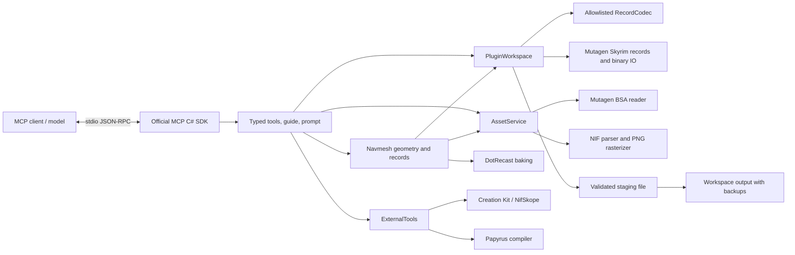

# Architecture

## Plugin sessions

Each stdio server process owns a bounded set of sessions. Each has a mutable SkyrimMod, ordered immutable master overlays, a monotonic revision, saved output metadata, and a bounded collection of checkpoints. A shared lock serializes reads and writes; MCP transports may dispatch calls concurrently.

Mutations clone the editable mod, apply typed operations, check identity invariants, and commit by retaining the clone. Exceptions restore the old instance and allocator. Batches use the same transaction and can refer to earlier created records through aliases. Dry runs retain the original revision and instance. Dependencies are read-only and ordered after recursively loading their own masters.

This favors correctness and straightforward rollback for authored patches. Full-mod cloning has a memory/time cost for large editable plugins. Master overlays do not get cloned for each edit. Future optimization should use a tested record-level journal; do not trade away rollback or reference integrity for speed.

## Record bridge

RecordCodec reflects public properties of allowlisted Mutagen Skyrim types. It provides bounded JSON reads and schemas, and decodes explicitly supported data shapes. Arbitrary CLR type names and assembly-qualified JSON types are not accepted. FormKeys cannot be assigned through the ordinary field updater. Child major records use allocation and parent insertion paths; nested copy uses Mutagen contexts.

Mutagen performs binary record layout, subrecord counts, compressed-record handling, FormKey serialization, and master index mapping. SehtMCP does not maintain a second ESP binary writer.

## Saving

The writer uses explicit master order, retains declared masters, and keeps Mutagen's own export checks enabled. The staged binary is fully imported and its identity set and flags checked. A new output is moved into place; replacing an output uses File.Replace with a backup. Outputs cannot escape the workspace through traversal or reparse-point directories. File hashes detect external changes since the previous save in the same session.

Atomicity is per plugin file. Localized multi-file output is blocked because it needs a different commit model. Process-local revisions do not coordinate separate clients; use separate workspaces or reconcile existing output explicitly.

## NIF reader

The parser is read-only and uses block size boundaries. It accepts Skyrim LE/SE header versions, checks counts/indices, parses texture sets and selected scene node/geometry types, and reports unsupported geometry. Position transforms use System.Numerics with NIF rotation conventions adapted to row vectors. The software renderer bounds image dimensions, geometry counts, and raster work; it returns a PNG through the SDK's image factory so the protocol carries correctly encoded image data.

This is a geometry inspection aid. Unsupported materials/skin/animation are not approximated as if they had been evaluated. The complete source NIF remains intact for external viewers.

## Interior navigation

`NavmeshGeometry` validates input triangle soups, rotates Skyrim Z-up coordinates into Recast Y-up without changing winding, and runs a bounded Recast raster/clearance/region/polygon-mesh build. It exports shared polygon topology with three vertices per polygon, reconstructs adjacency and separates connected components. Optional seed points retain only selected components. `NavmeshScene` collects explicitly supported placed NIF render geometry, preserving NIF and REFR transforms and reporting sources and exclusions.

The exporter omits Recast's optional per-polygon detail triangulation: testing it on stacked interior kit geometry exposed overlapping edges. Exported contour heights are quantized to `cellHeight`; precise surface matching still needs review. All managed console diagnostics are routed to stderr while the SDK owns raw stdout, including diagnostics from third-party geometry code.

`NavmeshRecords` writes NAVM under the interior cell and local NAVI information through Mutagen. It supplies interior parent links, reciprocal adjacency, bounds, an exhaustive single-bucket spatial grid, island geometry and explicit door associations. Rebuilds preserve FormKeys and reject inherited meshes, changed component counts and triangle links that would become stale. The plugin validator checks navigation structure before save. These operations use the same clone/revision/rollback boundary as other authoring tools; no running editor process is involved.

See [NAVMESH.md](NAVMESH.md) for input conventions, budgets and the boundary between render geometry and engine collision.

## Process integrations

Only configured CK/NifSkope/compiler executables can be launched. ProcessStartInfo.ArgumentList avoids shell concatenation. There is no generic execute-code or shell tool. Compiler output is captured separately from MCP stdout. Stdio stdout is reserved for protocol messages; application logs go to stderr.

## Verification

The test suite combines synthetic binary round trips, complex typed records, graph/reference errors, rollback, naming/range/path constraints, output backups, NIF geometry/malformed inputs, packaging, and MO2 priority interpretation. The Python verifier uses an independently implemented JSON-RPC client to check the real server boundary and optional installed-game behavior. Tests do not modify game Data or activate plugins.
